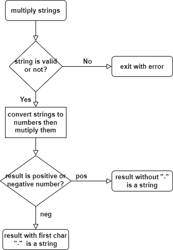

# Multiply Strings

## Requirement

Given two non-negative integers num1 and num2 represented as strings, return the product of num1 and num2, also represented as a string.

- Note: You must not use any built-in BigInteger library or convert the inputs to integer directly.

## Flowchart



## Explain Algorithm

The main idea is converting strings to numbers in order to multiply numbers; then, reconverting result from number to string.
It contains:

- Check all of characters of string are valid or not (invalid with non-numberic character), implements in validateNumber function at [validate.js](./libs/validate.js)
- If string is valid, carry out converting it to number, by summing of char.charCodeAt() - 48 returning Unicode value of a char multiply with the value of 10 to the power of char's units place. For example , 123 is 1*10^2 + 2*10^1 + 3\*10^0. This feature implemnts in convertStringToNumber function at [convert.js](./libs/convert.js)
- After converting, multiply numbers. Using handleSign function determines the sign of result: if

## Technologies

- JavaScripts
- Yarn

## Installation

To run the tests, follow these steps. You must have at least node v10 and yarn installed.

First clone the repository:

```
git clone https://github.com/19520477/Multiply_Strings.git
```

Move into the Multiply_Strings directory

```
cd Multiply_Strings/
```

Install dependencies

```
yarn install
```

Run tests

```
yarn test [param 1] [param 2]
```

where as param 1 and param 2 are the parameters of sequential operators of multiply function, which is under string format. For example:

```
yarn test "123" "456"
```
